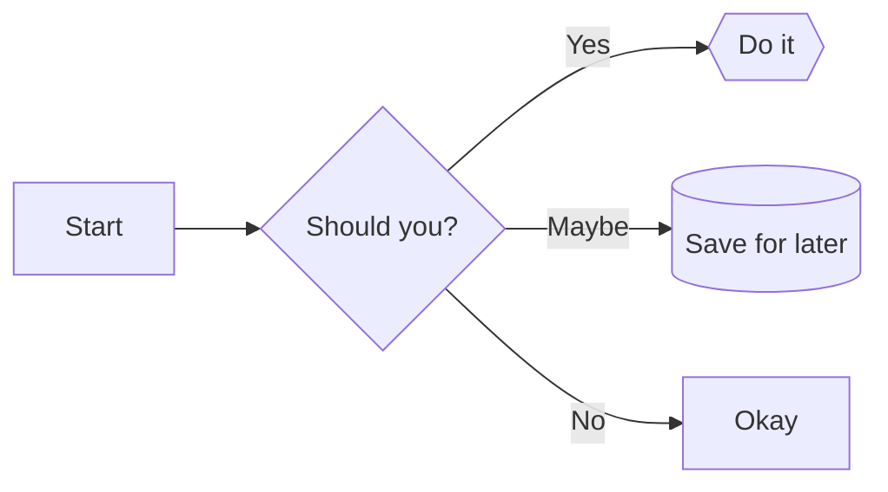
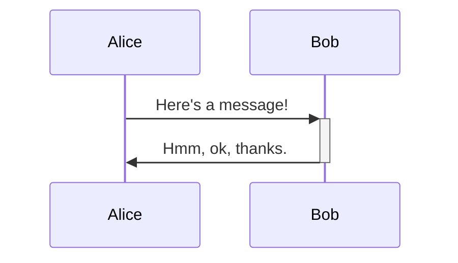
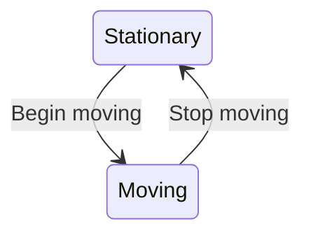
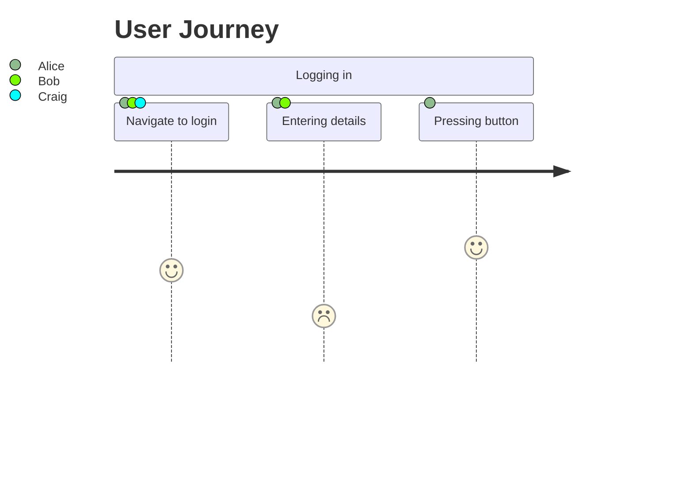
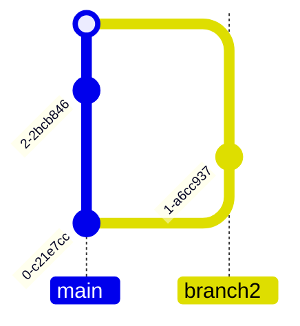
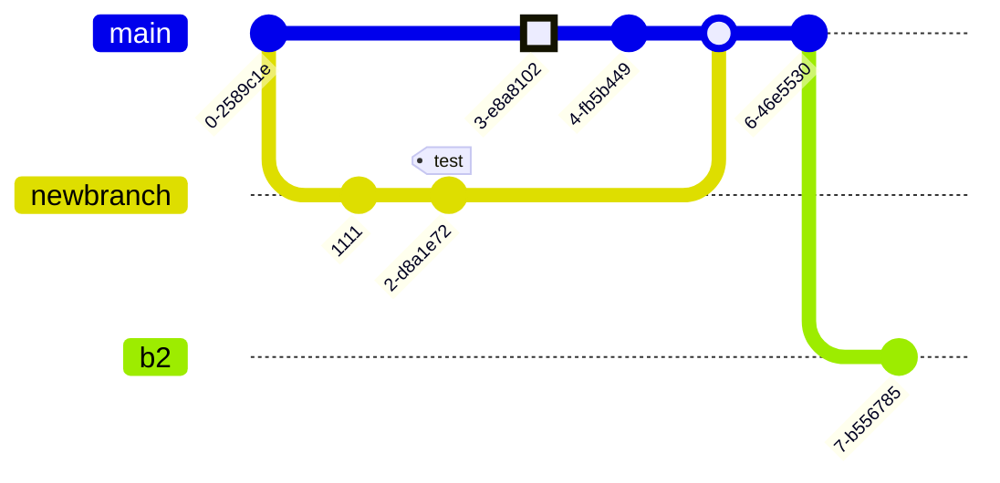

# Mermaid

```mermaid
flowchart LR
    A[Start] --> B{Should you?}
    B -- Yes --> C{{Do it}}
    B -- Maybe --> D[(Save for later)]
    B -- No --> E[Okay]
```

```mermaid
sequenceDiagram
    Alice ->>+ Bob: Here's a message!
    Bob ->>- Alice: Hmm, ok, thanks.
```

```mermaid
stateDiagram-v2
    Stationary --> Moving : Begin moving
    Moving --> Stationary : Stop moving
```

```mermaid
journey
    title User Journey
    section Logging in
        Navigate to login: 4: Alice, Bob, Craig
        Entering details: 2: Alice, Bob
        Pressing button: 5: Alice
```

```mermaid
gitGraph BT:
    commit
    branch branch2
    checkout branch2
    commit
    checkout main
    commit
    merge branch2
```

```mermaid
gitGraph:
    commit "Ashish"
    branch newbranch
    checkout newbranch
    commit id:"1111"
    commit tag:"test"
    checkout main
    commit type: HIGHLIGHT
    commit
    merge newbranch
    commit
    branch b2
    commit
```
