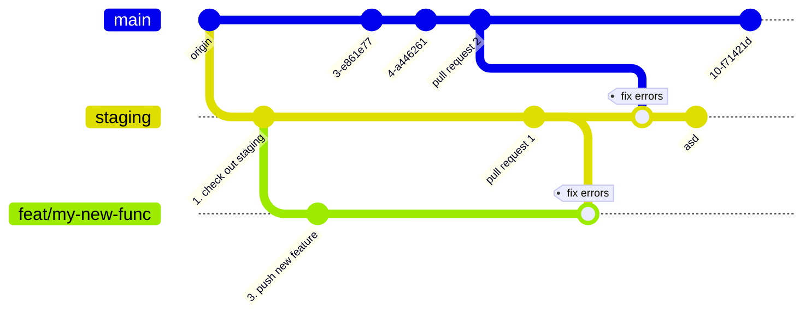

# Mermaid

%%{init: { 'logLevel': 'debug', 'theme': 'neutral' } }%%

## Flow to create a new feature

Locally
Checkout branch staging
Create a new feature branch
Add the new feature and push to remote

On GitHub
