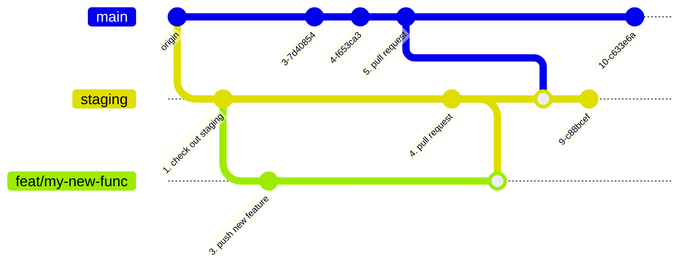

# Actions

GitHub actions demo repo.

## Flow to create a new feature

Locally

1. Checkout branch `staging`
2. Create a new feature branch `feat/my-new-feat`
3. Add the new feature and push to remote

On GitHub

4. Open a pull request against the `staging` branch

   - To complete the pull request the checks test, lint, build and deploy have to pass.
   - The new code is deployed to [https://staging.github-actions.pages.dev/](https://staging.github-actions.pages.dev/).
   - If the code works onthe staging server we can now continue and open a pull request agaist main.

5. Open a pull request against the `main` branch

   - To complete the pull request the checks test, lint and build have to pass.
   - If the pull request succeds we are now able to manually deploy to production.

6. Deploy to production by running the action `CD Prod (deploy to CloudFlare)` against `main`.
   - The production code is deployed to [https://github-actions.pages.dev/](https://github-actions.pages.dev/).

### Mermaid gitGraph

